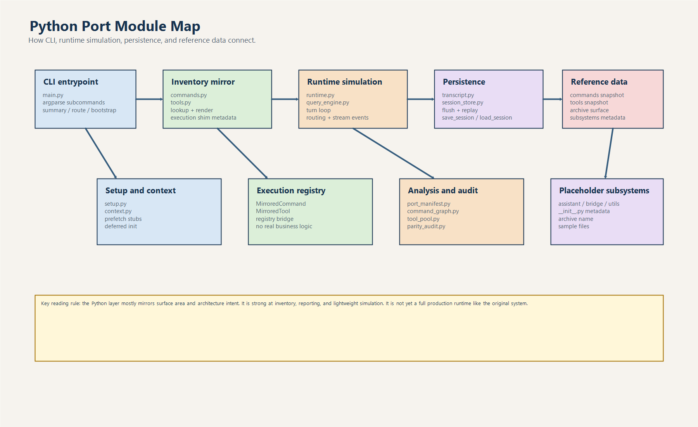
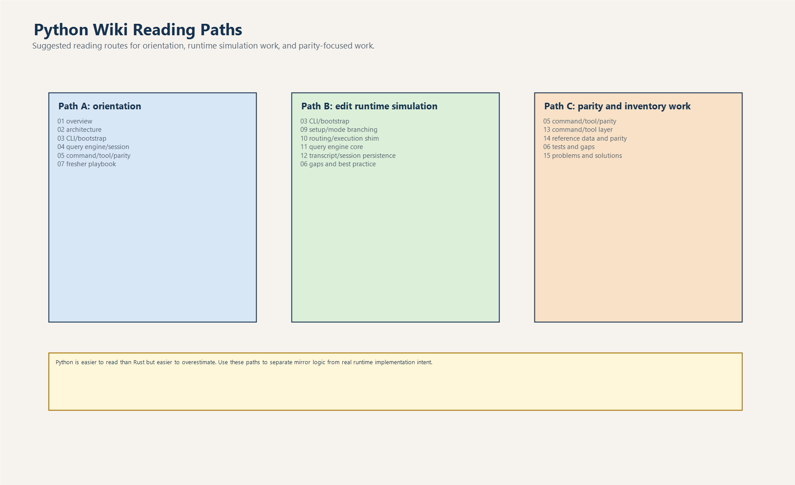

# Lộ Trình Đọc Python Wiki

## 1. Mục tiêu của file này

File này là bản đồ điều hướng cho toàn bộ tài liệu Python.
Nó giúp người đọc chọn đúng nhánh tài liệu theo mục tiêu:

- cần hiểu nhanh toàn cảnh
- cần đọc sâu kiến trúc
- cần lần theo luồng code
- cần soi issue kỹ thuật

## 2. Có 2 tầng tài liệu

### Tầng 1: đọc nhanh để nắm dự án

Đây là lớp overview, phù hợp cho ngày đầu onboarding:

1. `01-tong-quan-python-port.md`
2. `02-kien-truc-thanh-phan.md`
3. `03-cli-bootstrap-routing.md`
4. `04-query-engine-session-persistence.md`
5. `05-command-tool-parity-reference-data.md`
6. `06-tests-khoang-trong-best-practice.md`
7. `07-playbook-thuc-hanh-cho-fresher.md`

### Tầng 2: đọc sâu theo chuyên đề

Đây là lớp deep dive, phù hợp khi bắt đầu sửa code hoặc review port:

1. `08-main-parser-va-subcommand.md`
2. `09-setup-bootstrap-va-mode-branching.md`
3. `10-routing-va-execution-shim.md`
4. `11-query-engine-core.md`
5. `12-transcript-session-store-va-persistence.md`
6. `13-command-tool-layer-va-permission.md`
7. `14-reference-data-subsystem-va-parity.md`

## 3. Đọc theo nhu cầu

### Nếu bạn là fresher mới vào

Đọc theo thứ tự:

1. `01`
2. `02`
3. `03`
4. `07`
5. `08`
6. `11`

Mục tiêu:

- hiểu Python đang đóng vai trò gì
- biết đâu là code thật, đâu là placeholder
- biết luồng chạy từ CLI tới session

### Nếu bạn chuẩn bị sửa logic runtime mô phỏng

Đọc theo thứ tự:

1. `03`
2. `09`
3. `10`
4. `11`
5. `12`
6. `06`

Mục tiêu:

- hiểu bootstrap flow
- hiểu routing và registry
- hiểu side effect trong query engine
- tránh đụng phải bug double-submit

### Nếu bạn chuẩn bị cập nhật snapshot hoặc parity audit

Đọc theo thứ tự:

1. `05`
2. `13`
3. `14`
4. `06`

Mục tiêu:

- hiểu snapshot đang là source of truth cho lớp mirror
- biết cách command/tool inventory được dựng lên
- biết parity audit thật sự đang đo cái gì

## 4. Một số nguyên tắc đọc code Python port

- đừng giả định package nào cũng có runtime logic thật
- luôn phân biệt `mirror surface` với `runtime implementation`
- mọi thứ liên quan state nên lần theo `QueryEnginePort`
- mọi thứ liên quan inventory nên lần theo snapshot JSON trước
- khi thấy report đẹp, hãy kiểm tra xem dữ liệu đến từ đâu: code thật hay metadata

## 5. Những file xương sống nhất

Nếu chỉ có 30 phút, hãy đọc 5 file này:

1. `src/main.py`
2. `src/runtime.py`
3. `src/query_engine.py`
4. `src/commands.py`
5. `src/tools.py`

Đây là 5 file quyết định cách người đọc hiểu nhầm hoặc hiểu đúng cả Python port.

## 6. Chốt lại

Hãy xem bộ wiki này như 2 lớp:

- lớp 1 giúp hiểu bản đồ
- lớp 2 giúp hiểu từng cơ quan trong cơ thể hệ thống

Nếu đọc đúng thứ tự, fresher sẽ không bị ngộp và senior reviewer cũng có chỗ để đào sâu nhanh.
