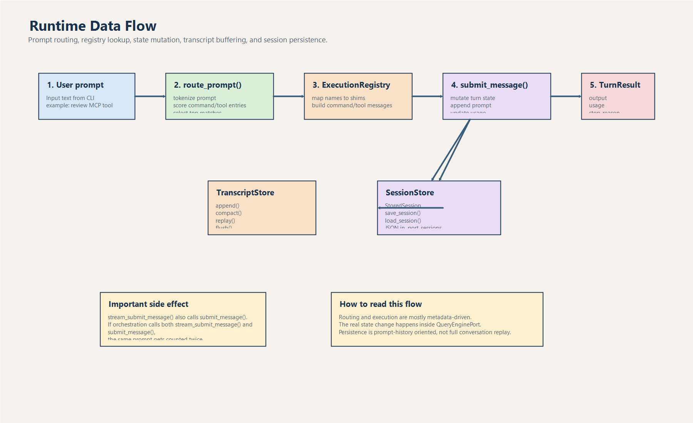

# Kiến Trúc Và Thành Phần Python

## 1. Kiến trúc tổng thể

Phần Python có thể chia thành 6 lớp:

1. Lớp CLI entrypoint.
2. Lớp inventory mirror cho command/tool.
3. Lớp runtime mô phỏng.
4. Lớp setup/bootstrap/context.
5. Lớp persistence và transcript.
6. Lớp reference data và placeholder subsystem.

## 2. Bản đồ module cốt lõi

| Module | Vai trò chính | Nhận xét |
|---|---|---|
| `main.py` | Router CLI | Cửa vào chính |
| `port_manifest.py` | Đếm và mô tả surface Python | Dùng khi chạy `manifest`, `summary` |
| `models.py` | Dataclass dùng chung | Loại dữ liệu rất gọn |
| `commands.py` | Nạp snapshot command mirror | Không thực thi logic thật |
| `tools.py` | Nạp snapshot tool mirror | Có filter theo permission context |
| `runtime.py` | Route prompt, bootstrap session, turn loop mô phỏng | Lõi orchestration của Python layer |
| `query_engine.py` | Giữ state turn, transcript, usage, structured output | Lõi stateful simulation |
| `setup.py` | Mô tả startup path | Có prefetch giả lập và deferred init |
| `context.py` | Dựng context thư mục hiện tại | Đếm source/tests/assets/archive |
| `parity_audit.py` | So bề mặt Python với archive snapshot | Dùng để đo coverage |
| `execution_registry.py` | Registry command/tool shim | Gọi `execute_command`/`execute_tool` |
| `session_store.py` | Lưu session JSON đơn giản | Không lưu full conversation |
| `transcript.py` | Buffer transcript trong memory | Có `append`, `compact`, `flush` |
| `permissions.py` | Chặn tool theo deny-name/prefix | Rất đơn giản |
| `command_graph.py` | Chia command thành builtin/plugin-like/skill-like | Dựa vào `source_hint` |
| `tool_pool.py` | Gom tool theo chế độ | Có `simple_mode`, `include_mcp` |
| `bootstrap_graph.py` | Mô tả các phase bootstrap | Chỉ là graph mô tả |

## 3. Dòng chảy dữ liệu chính

### 3.1. Inventory data source

Nguồn dữ liệu không nằm ở code runtime thật mà nằm ở snapshot:

- `src/reference_data/commands_snapshot.json`
- `src/reference_data/tools_snapshot.json`
- `src/reference_data/archive_surface_snapshot.json`
- `src/reference_data/subsystems/*.json`

Tức là:

- Python code đọc snapshot.
- Từ snapshot dựng object dataclass.
- Từ dataclass dựng report, route, audit, summary.

### 3.2. Flow dữ liệu trong runtime mô phỏng

Ảnh trên cho thấy data flow thật sự của Python port:

- prompt đi vào `route_prompt()`
- match được bridge sang `ExecutionRegistry`
- state chỉ mutate khi vào `QueryEnginePort.submit_message()`
- transcript và session file là hai lớp khác nhau

## 4. Chi tiết từng nhóm module

### 4.1. Nhóm CLI và orchestration

#### `main.py`

Module này làm 3 việc:

1. Dựng parser bằng `argparse`.
2. Map subcommand sang module phù hợp.
3. In kết quả ra stdout.

Tất cả luồng chạy chính đều đi qua đây.

#### `runtime.py`

`PortRuntime` là điều phối viên chính của Python layer.
Nó không gọi LLM thật.
Nó làm các bước:

- tokenize prompt rất đơn giản
- chấm điểm command/tool mirror
- dựng `RuntimeSession`
- gọi execution shim
- sinh stream events mô phỏng
- persist session

### 4.2. Nhóm data model

#### `models.py`

Đây là lớp kiểu dữ liệu nền:

- `Subsystem`
- `PortingModule`
- `PermissionDenial`
- `UsageSummary`
- `PortingBacklog`

Điểm hay:

- ngắn gọn
- dễ đọc
- đúng tinh thần mirror layer

Điểm hạn chế:

- model đơn giản, không đủ để biểu diễn runtime thật

### 4.3. Nhóm inventory mirror

#### `commands.py`

- load JSON snapshot bằng `lru_cache(maxsize=1)`
- biến mỗi entry thành `PortingModule`
- hỗ trợ tìm theo query
- hỗ trợ filter plugin commands / skill commands
- `execute_command()` chỉ trả về message kiểu shim

#### `tools.py`

- tương tự `commands.py`
- có thêm `ToolPermissionContext`
- có `simple_mode`
- có `include_mcp`
- `execute_tool()` cũng chỉ là shim trả message

### 4.4. Nhóm setup và bootstrap

#### `setup.py`

Mô tả startup pipeline ở mức trừu tượng:

- MDM raw read prefetch
- keychain prefetch
- project scan
- deferred init

Tất cả đang là mô phỏng.

#### `bootstrap_graph.py`

Đây là file rất quan trọng với người onboarding vì nó nói ra ý đồ kiến trúc:

- prefetch side effects
- warning/env guards
- CLI parser + trust gate
- setup + load commands/agents
- deferred init
- mode routing
- query engine submit loop

Nó không chạy bootstrap thật, nhưng cho biết nhóm tác giả đang muốn mirror flow bootstrap của hệ thống gốc như thế nào.

### 4.5. Nhóm persistence

#### `transcript.py`

Rất đơn giản:

- `append(entry)`
- `compact(keep_last)`
- `replay()`
- `flush()`

`TranscriptStore` chỉ là buffer list trong memory.

#### `session_store.py`

Lưu session thành JSON trong `.port_sessions/`.

Session chứa:

- `session_id`
- `messages`
- `input_tokens`
- `output_tokens`

Lưu ý:

- `messages` ở đây là danh sách prompt đã submit, không phải full structured conversation.

### 4.6. Nhóm placeholder subsystem

Các package như:

- `assistant`
- `bridge`
- `services`
- `skills`
- `utils`
- `cli`
- `components`

đa số chỉ có `__init__.py`.

Pattern chung:

1. Đọc file `src/reference_data/subsystems/<name>.json`
2. Expose:
   - `ARCHIVE_NAME`
   - `MODULE_COUNT`
   - `SAMPLE_FILES`
   - `PORTING_NOTE`

Ý nghĩa:

- giữ tên package giống bề mặt archive
- cung cấp metadata để test/onboarding/query
- chưa có logic runtime thực

## 5. Subsystem nào lớn nhất theo snapshot?

Theo `reference_data/subsystems/*.json`, các nhóm lớn nhất là:

- `utils`: 564 module archive
- `components`: 389
- `services`: 130
- `hooks`: 104
- `bridge`: 31
- `constants`: 21
- `skills`: 20
- `cli`: 19

Điều này cực kỳ quan trọng cho fresher:

- trọng tâm kiến trúc gốc nhiều khả năng nằm ở `utils`, `components`, `services`, `hooks`, `cli`
- nhưng trong Python layer, những nhóm này mới chỉ được biểu diễn bằng metadata

## 6. Module nhỏ nhưng đáng chú ý

### `projectOnboardingState.py`

Chứa state onboarding cực tối giản:

- có README không
- có test không
- `python_first=True`

### `ink.py`, `interactiveHelpers.py`, `dialogLaunchers.py`, `replLauncher.py`

Đây là các stub nhỏ để giữ root surface parity:

- panel render
- bullet helper
- dialog metadata
- REPL banner

Chúng có tác dụng nhiều hơn ở onboarding/documentation hơn là runtime.

## 7. Kết luận

Nếu nhìn theo tư duy senior engineer, kiến trúc Python này là:

- **rõ mục tiêu**
- **nhẹ**
- **dễ kiểm kê**
- **tốt cho onboarding**

nhưng cũng:

- **không phải runtime hoàn chỉnh**
- **có nhiều placeholder**
- **phù hợp để học bề mặt hơn là chạy nghiệp vụ thật**
