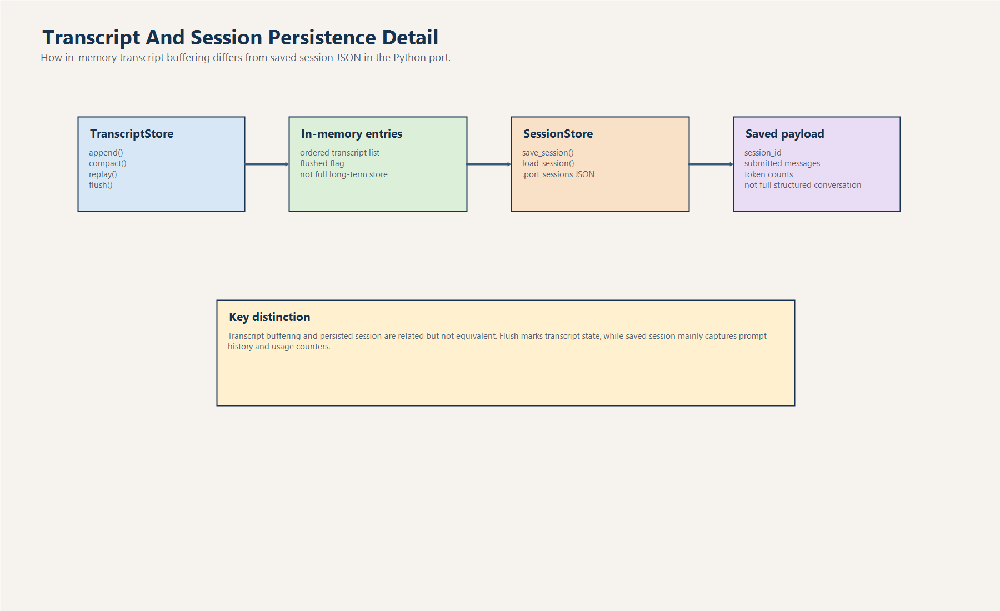

# Transcript, Session Store Và Persistence

## 1. Vì sao phải tách riêng chủ đề persistence?

Trong codebase này, nhiều người mới dễ gộp 3 khái niệm thành một:

- transcript
- message history
- persisted session

Thực tế đây là 3 lớp liên quan nhưng không giống nhau.

File này tách riêng chủ đề đó để tránh hiểu sai.

## 2. `TranscriptStore` trong `transcript.py`

`TranscriptStore` là abstraction nhỏ nhất trong toàn bộ phần persistence.

Nó chỉ có:

- `entries`
- `flushed`

và 4 method:

- `append()`
- `compact()`
- `replay()`
- `flush()`

### 2.1. Bản chất thật

Đây là:

- in-memory buffer
- danh sách string
- không có IO

Nó không phải:

- database
- file-backed log
- full conversation ledger

### 2.2. `flush()` đang làm gì?

`flush()` chỉ set:

- `flushed = True`

Nó không:

- ghi file
- xoá buffer
- đồng bộ với storage backend

Đây là chỗ dễ hiểu nhầm nhất.

## 3. `mutable_messages` trong `QueryEnginePort`

Song song với `TranscriptStore.entries`, engine còn giữ:

- `mutable_messages`

Đây là history riêng của engine dùng cho session hiện tại.
Nó cũng chỉ là danh sách string prompt.

Nghĩa là hiện có hai lớp list gần nhau:

- transcript entries
- mutable messages

Chúng thường giống nhau, nhưng không nên coi là cùng một abstraction.

## 4. `SessionStore` trong `session_store.py`

`session_store.py` mới là nơi có IO thật.

Nó định nghĩa:

- `StoredSession`
- `save_session()`
- `load_session()`
- `DEFAULT_SESSION_DIR = .port_sessions`

Schema hiện tại:

- `session_id`
- `messages`
- `input_tokens`
- `output_tokens`

Đây là schema rất gọn, gần như schema tối thiểu để nói rằng:

- session đã tồn tại
- session có history prompt
- session có usage tổng

## 5. Vòng đời persist hiện tại

Luồng hiện tại trong `QueryEnginePort.persist_session()` là:

1. gọi `flush_transcript()`
2. gọi `save_session(StoredSession(...))`
3. trả path file JSON

Điểm phải nhớ:

- file JSON được xây từ `mutable_messages`
- không phải từ transcript entry

Nói cách khác:

- transcript buffer và persisted session hiện chỉ nối với nhau lỏng

## 6. `load_session()` phục hồi được những gì?

Khi gọi `load_session(session_id)` hoặc `QueryEnginePort.from_saved_session(session_id)`, hệ thống chỉ phục hồi:

- session id
- prompt history
- tổng input tokens
- tổng output tokens

Chưa phục hồi:

- output từng turn
- matched command/tool từng turn
- denial từng turn
- stream events
- setup/context metadata
- timestamps

## 7. Hệ quả thiết kế của schema tối giản

### 7.1. Ưu điểm

- dễ serialize
- dễ debug bằng mắt
- khó lỗi migration hơn khi hệ thống còn đang thay đổi nhanh

### 7.2. Nhược điểm

- replay nghèo
- audit trail nghèo
- không suitable cho phân tích hành vi sâu
- không đủ để dựng lại bootstrap report một cách trung thực

## 8. Bug double-submit ảnh hưởng persistence ra sao?

Đây là chỗ persistence bị lộ vấn đề rõ nhất.

Vì `bootstrap_session()` hiện:

- gọi `stream_submit_message()`
- rồi lại gọi `submit_message()`

nên `mutable_messages` bị append hai lần cho cùng một prompt.
Khi persist:

- file session sẽ có prompt lặp
- usage totals bị đội lên

Tức là persistence layer hiện chưa sai độc lập.
Nó đang phản ánh đúng state sai do orchestration tạo ra.

## 9. Nên nâng cấp persistence theo hướng nào?

Hướng hợp lý nhất là đổi từ:

- `messages: tuple[str, ...]`

sang:

- `turns: list[TurnRecord]`

Trong mỗi `TurnRecord` có thể có:

- role
- prompt
- output
- matched_commands
- matched_tools
- denials
- input_tokens
- output_tokens
- timestamp

Nếu đi theo hướng này:

- session sẽ replay tốt hơn
- debug tốt hơn
- audit tốt hơn

## 10. Có cần database không?

Chưa chắc.

Ở giai đoạn hiện tại, JSON file vẫn đủ nếu mục tiêu là:

- onboarding
- demo flow
- nhẹ, dễ mang đi

Database chỉ đáng nghĩ tới nếu:

- cần query session nhiều
- cần nhiều writer
- cần retention dài hạn
- cần phân tích thống kê lớn

## 11. Best practice khi đụng vào phần persistence

- luôn kiểm tra nguồn dữ liệu persist lấy từ đâu
- đừng giả định `flush()` nghĩa là write-to-disk
- nếu đổi schema, thêm version field sớm
- nếu sửa orchestration, kiểm tra file session có còn lặp prompt không
- bổ sung test cho file thiếu field hoặc JSON hỏng

## 12. Chốt lại

Persistence trong Python port hiện tại là:

- đủ nhẹ để học và demo
- đủ rõ để người mới theo dõi
- nhưng chưa đủ giàu cho replay và debug sâu

Muốn hiểu đúng, phải phân biệt rõ:

- transcript buffer
- engine message history
- session JSON trên đĩa
