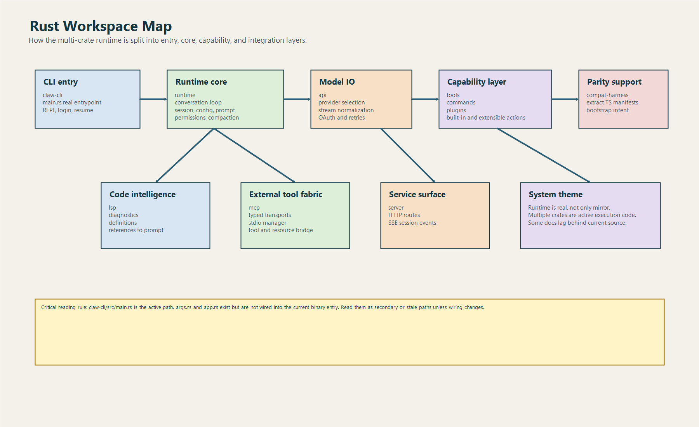
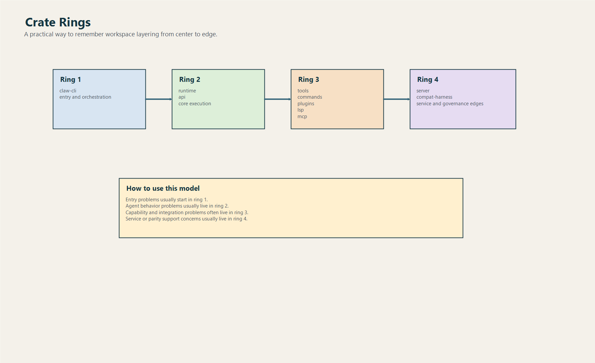

# Bản Đồ Workspace Và Crates

## 1. Sơ đồ tổng thể

## 2. Danh sách crate và vai trò

| Crate | Vai trò chính | Cái cần nhớ |
|---|---|---|
| `claw-cli` | Binary CLI, REPL, login/logout, resume, render output | Cửa vào thật của hệ thống |
| `runtime` | Conversation loop, session, prompt, config, permission, compaction, hooks | Tim hệ thống |
| `api` | Provider abstraction, auth, streaming, SSE normalization | Lớp nói chuyện với model |
| `tools` | Built-in tool catalog + execute + subset control | Tay chân built-in của agent |
| `commands` | Slash command registry + workflow handler | Workflow người dùng |
| `plugins` | Plugin manifest, install/enable/disable, hooks, lifecycle, plugin tools | Ecosystem mở rộng |
| `compat-harness` | Rút manifest từ TypeScript upstream | Parity support |
| `lsp` | Diagnostics, go-to-definition, references, prompt enrichment | Code intelligence |
| `server` | Session service HTTP/SSE | Service surface |

## 3. Dependency mindset

Nếu không nhìn theo `Cargo.toml`, có thể nhìn theo logic trách nhiệm:

- `claw-cli` đứng trên cùng
- `runtime` là nền giữa
- `api`, `tools`, `commands`, `plugins`, `lsp`, `server` là các module chuyên biệt cắm vào nền đó
- `compat-harness` đứng hơi lệch, chủ yếu phục vụ so chiếu upstream

## 4. Crate nào là xương sống

### 4.1. `runtime`

`runtime/src/lib.rs` re-export gần như toàn bộ bề mặt quan trọng:

- bootstrap
- compact
- config
- conversation
- file_ops
- hooks
- mcp
- mcp_client
- mcp_stdio
- oauth
- permissions
- prompt
- remote
- sandbox
- session
- usage

Điều đó cho thấy `runtime` được thiết kế như core package để các crate khác dựa vào.

### 4.2. `claw-cli`

`claw-cli` không chỉ in ra terminal.
Nó giữ khá nhiều orchestration:

- parse args thủ công
- chọn action
- khởi tạo `LiveCli`
- load config
- load plugin manager
- build tool registry
- chạy REPL
- login/logout bằng OAuth loopback
- resume session và slash command được hỗ trợ

### 4.3. `tools` và `commands`

Đây là hai crate mà fresher hay coi nhầm là “chỉ metadata”.

Thực tế:

- `tools` có tool spec, input schema, permission requirement, execute logic
- `commands` có slash command registry và nhiều workflow handler thật

## 5. Cần đọc crate theo thứ tự nào

### Thứ tự đọc tốt nhất cho người mới

1. `claw-cli`
2. `runtime`
3. `tools`
4. `commands`
5. `api`
6. `plugins`
7. `mcp` + `lsp` + `server`
8. `compat-harness`

Lý do:

- phải biết cửa vào trước
- sau đó biết tim agent loop
- rồi mới biết tay chân, workflow và integration

## 6. Phát hiện quan trọng: đường chạy thật trong `claw-cli`

Đây là điểm cực kỳ quan trọng.

Trong `claw-cli/src/` có:

- `main.rs`
- `args.rs`
- `app.rs`

Nhưng binary hiện tại chạy theo `main.rs`.

Lý do:

- `Cargo.toml` trỏ binary `claw` vào `src/main.rs`
- `main.rs` chỉ khai báo `mod init; mod input; mod render;`
- không có `mod args;`
- không có `mod app;`

Kết luận:

- `args.rs` không nằm trên đường chạy thật
- `app.rs` cũng không nằm trên đường chạy thật
- hai file này nhiều khả năng là code cũ, code thử, hoặc scaffold chưa dùng

Nếu tài liệu không nói rõ điểm này, người mới sẽ lần nhầm và mất rất nhiều thời gian.

## 7. Cách chia crate thành 4 vòng

### Vòng 1: entry và orchestration

- `claw-cli`

### Vòng 2: runtime core

- `runtime`
- `api`

### Vòng 3: capability layer

- `tools`
- `commands`
- `plugins`
- `mcp`
- `lsp`

### Vòng 4: support và external surface

- `server`
- `compat-harness`

Mô hình này giúp bạn review kiến trúc nhanh hơn:

- sự cố “CLI không chạy đúng” thường nằm ở vòng 1
- sự cố “agent loop sai” thường ở vòng 2
- sự cố “tool/plugin/MCP/LSP” ở vòng 3
- sự cố parity hoặc service API ở vòng 4

## 8. Một vài nhận xét senior-level

### Điểm tốt

- workspace chia crate khá sạch
- `runtime` đóng vai core hợp lý
- nhiều struct/config typed rõ ràng
- test có mặt ở nhiều crate
- plugin, command, tool đều cố giữ registry rõ ràng

### Điểm cần cảnh giác

- có dấu hiệu code song song hoặc stale path trong `claw-cli`
- README chưa phản ánh hết code thực tế
- tính năng transport của MCP không đồng đều giữa “typed config” và “operational manager”

## 9. Chốt lại

Nếu bạn phải nhớ một bản đồ cực ngắn:

- `claw-cli` nhận ý định người dùng
- `runtime` biến ý định đó thành agent loop
- `api` mang loop ra model
- `tools/plugins/commands` cho agent hành động
- `mcp/lsp/server` mở rộng bề mặt tích hợp
- `compat-harness` nối Rust với upstream TypeScript ở mức kiểm kê bề mặt
