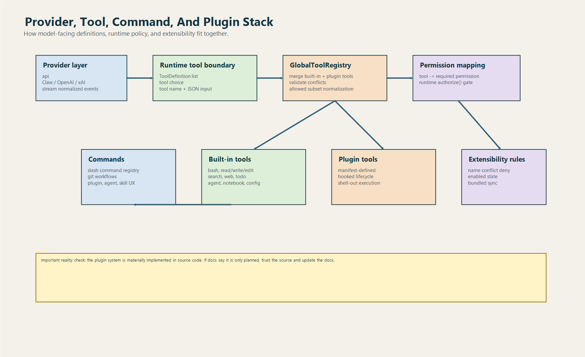
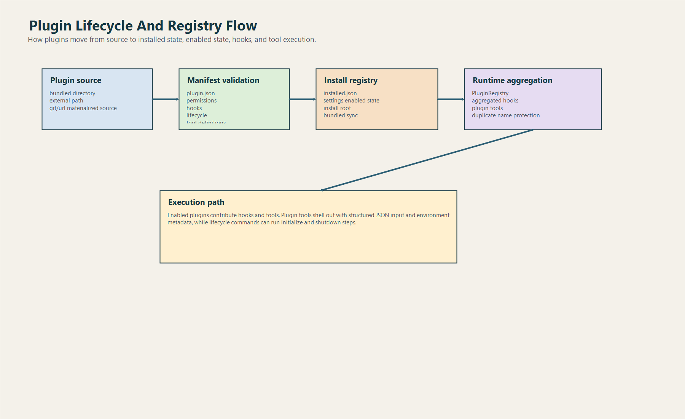

# Tools, Commands Và Plugins

## 1. Đây là lớp “hành động” của hệ thống

Nếu `runtime` là tim và `api` là miệng tai kết nối với model, thì:

- `tools` là tay chân built-in
- `commands` là workflow shell của người dùng
- `plugins` là cơ chế mở rộng

Ba crate này giải bài toán: làm sao để agent không chỉ trả lời, mà còn có thể hành động theo cách có tổ chức.

## 2. Crate `tools` làm gì

`tools/src/lib.rs` không chỉ là manifest.

Nó giữ:

- built-in tool spec
- input schema
- required permission
- allowed tool normalization
- execution dispatch
- plugin tool integration

### 2.1. `GlobalToolRegistry`

Đây là đầu mối hợp nhất:

- built-in tools
- plugin tools

Nó còn:

- phát hiện conflict tên tool
- normalize `--allowedTools`
- sinh `ToolDefinition` cho provider call
- sinh permission mapping cho runtime

### 2.2. Built-in tool catalog khá rộng

Từ source đọc được, các nhóm tool đáng chú ý gồm:

- shell: `bash`, `PowerShell`
- file ops: `read_file`, `write_file`, `edit_file`
- search: `glob_search`, `grep_search`
- web: `WebFetch`, `WebSearch`
- planning/state: `TodoWrite`, `StructuredOutput`
- discovery: `ToolSearch`, `Skill`
- advanced editing: `NotebookEdit`
- interaction: `SendUserMessage`
- meta/runtime: `Config`, `REPL`, `Sleep`
- delegation: `Agent`

Điểm này quan trọng vì nó cho thấy Rust port đã có bề mặt tool tương đối phong phú.

## 3. Vì sao `--allowedTools` quan trọng

CLI có thể truyền subset tool vào runtime.

Registry sẽ:

- nhận alias như `read`, `write`, `glob`, `grep`
- map về canonical tool name
- validate tool có tồn tại
- tạo allowed set

Ý nghĩa:

- giảm blast radius
- hỗ trợ mode an toàn hơn
- phù hợp với principle of least privilege

## 4. Execution trong `tools` hoạt động ra sao

Khi runtime yêu cầu chạy tool:

1. `GlobalToolRegistry::execute(name, input)`
2. nếu là built-in -> `execute_tool`
3. nếu là plugin tool -> `PluginTool::execute`

Đây là kiến trúc hợp lý vì runtime không cần biết tool đến từ đâu.

## 5. Crate `commands` giải gì

`commands` là nơi tập trung slash command.

Nó có:

- `SlashCommandSpec`
- registry command
- parser slash command
- render help
- handlers cho workflow thực dụng

### 5.1. Danh sách command đáng chú ý

Từ source, có nhiều command như:

- `help`
- `status`
- `compact`
- `model`
- `permissions`
- `clear`
- `cost`
- `resume`
- `config`
- `memory`
- `init`
- `diff`
- `version`
- `bughunter`
- `branch`
- `worktree`
- `commit`
- `commit-push-pr`
- `pr`
- `issue`
- `ultraplan`
- `teleport`
- `debug-tool-call`
- `export`
- `session`
- `plugin`
- `agents`
- `skills`

Đây là bề mặt workflow khá lớn.

### 5.2. Resume-safe command

`resume_supported_slash_commands()` tách ra nhóm command được phép khi resume session.

Điểm này tốt vì:

- resume là trạng thái nhạy cảm
- không nên cho mọi workflow chạy bừa trên session đã lưu

## 6. Agent và skill discovery

`commands` còn có logic discover agent/skill từ nhiều root:

- project local `.codex`
- project local `.claw`
- user home kiểu `~/.codex` hoặc `~/.claw`

Đây là dấu hiệu hệ thống đã có tư duy ecosystem và reusable prompt/agent definition.

## 7. Plugin system thực tế hơn README mô tả

Đây là một phát hiện rất quan trọng.

README của Rust có chỗ nói plugin system còn planned.
Nhưng source trong `plugins` cho thấy ngược lại.

### 7.1. Plugin manager đã có những gì

- manifest parser
- installed registry
- enabled state
- bundled plugin sync
- install từ source
- enable/disable
- uninstall
- update
- lifecycle init/shutdown
- aggregated hooks
- plugin tool execution

### 7.2. Plugin manifest có gì

Plugin manifest mô tả:

- name
- version
- description
- permissions
- hooks
- lifecycle
- tools
- commands
- default enabled

### 7.3. Bundled plugin là gì

Code có root bundled plugin ngay trong crate.

Manager sẽ:

- scan bundled root
- copy vào install root
- sync registry
- prune bundled entry stale

Đây không phải bản phác thảo. Đây là một hệ thống plugin có hành vi thật.

## 8. Hooks của plugin khác gì hooks runtime

Giống nhau ở ý tưởng:

- pre-tool
- post-tool
- shell-out ra ngoài

Khác nhau ở scope:

- runtime hooks đến từ config runtime
- plugin hooks đến từ plugin registry và plugin manifest

Hai lớp này giúp hệ thống có nhiều điểm can thiệp policy hơn.

## 9. Điểm mạnh của kiến trúc hiện tại

### Registry-first design

Command, tool và plugin đều đi theo hướng registry khá rõ.

Điều này giúp:

- dễ kiểm kê
- dễ render help
- dễ validate conflict
- dễ nối vào permission policy

### Built-in và plugin cùng nói một ngôn ngữ

Đây là điểm tốt:

- runtime chỉ thấy tool name + input
- registry lo chuyện tool nào built-in, tool nào plugin

## 10. Rủi ro và chỗ cần để ý

### Tool surface quá rộng

Càng nhiều tool, càng cần:

- permission mapping chặt
- test kỹ schema
- logging và observability tốt

### Workflow command có side effect mạnh

Các command như:

- branch
- worktree
- commit
- commit-push-pr

đụng trực tiếp Git workflow.
Nếu behavior hoặc assumption không rõ, trải nghiệm người dùng sẽ dễ vỡ.

### Plugin doc drift

Khi README và source không khớp, onboarding rất dễ lệch.

## 11. Kết luận

`tools`, `commands`, `plugins` là lớp biến Rust port thành một coding agent hành động được.

Muốn mở rộng hệ thống đúng cách, hãy nhớ:

- thêm tool thì nghĩ permission trước
- thêm command thì nghĩ workflow safety trước
- thêm plugin thì nghĩ registry, lifecycle và conflict trước
