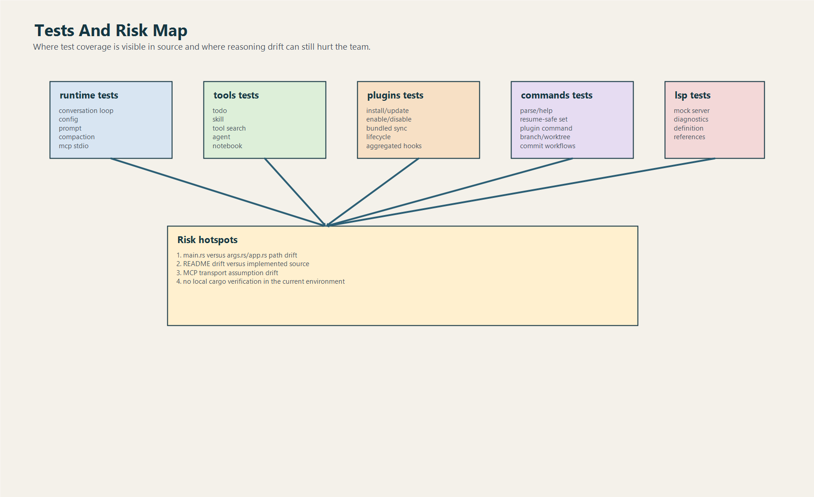

# Tests, Rủi Ro Và Best Practice

## 1. Tài liệu này dùng để làm gì

File này trả lời 3 câu hỏi thực dụng:

1. code đã được kiểm tra ở đâu
2. rủi ro lớn hiện tại là gì
3. người mới nên làm việc với workspace Rust theo best practice nào

## 2. Những vùng đã có test đáng kể

Qua source hiện tại có thể thấy test xuất hiện ở nhiều crate quan trọng:

### `runtime`

Các cụm test nổi bật:

- conversation loop
- tool deny
- hook deny
- post-hook feedback
- usage tracker restore
- session persistence roundtrip
- config precedence và parse typed config
- prompt discovery
- compaction behavior
- mcp stdio manager behavior
- sandbox detection

### `lsp`

Có test mock LSP server cho:

- diagnostics
- go to definition
- references
- context enrichment render

### `plugins`

Có test cho:

- install
- enable
- disable
- uninstall
- update
- bundled sync
- registry pruning
- lifecycle init/shutdown
- aggregated hooks

### `tools`

Có test cho:

- todo write
- skill loading
- tool search alias
- agent tool persistence và subset mapping
- notebook edit
- structured output

### `commands`

Có test cho:

- slash command parse/help
- resume-supported command set
- plugin command
- branch/worktree command
- commit và commit-push-pr flow

## 3. Một giới hạn xác minh cần ghi thật rõ

Ở môi trường hiện tại:

- `cargo` không có trong `PATH`

Nghĩa là:

- chưa chạy lại `cargo test`
- chưa build lại toàn workspace từ máy này

Tài liệu này vì thế phản ánh:

- source code hiện diện
- test code hiện diện
- intent và coverage đọc từ source

chứ chưa phải kết luận “đã chạy xanh trên máy hiện tại”.

## 4. Rủi ro kỹ thuật lớn nhất hiện tại

### 4.1. Code path active và code path stale cùng tồn tại trong `claw-cli`

Đây là rủi ro onboarding số 1.

`main.rs` là đường chạy thật.
`args.rs` và `app.rs` hiện không nằm trên critical path.

Rủi ro:

- fresher sửa nhầm file không được dùng
- reviewer hiểu nhầm bề mặt CLI thật
- tài liệu drift rất nhanh

### 4.2. README drift với source

Ví dụ rõ nhất:

- README mô tả plugin system như planned
- source cho thấy plugin system đã hoạt động ở mức đáng kể

Rủi ro:

- tài liệu chính thức gây hiểu sai năng lực hệ thống
- team đánh giá sai mức độ hoàn thiện

### 4.3. MCP transport breadth lớn hơn operational depth

Config hỗ trợ nhiều transport, nhưng manager operational hiện rõ nhất ở stdio.

Rủi ro:

- dev nghĩ SSE/HTTP/WS/SDK đều đã có execution path ngang nhau
- bug được tạo ra từ assumption sai

### 4.4. Parser CLI thủ công khá dài

Điểm này không sai, nhưng maintenance cost cao.

Rủi ro:

- khó giữ behavior nhất quán
- dễ phát sinh nhánh edge case
- khó đồng bộ với help text hoặc README

## 5. Best practice khi sửa code Rust workspace

### Luôn bắt đầu từ đường chạy thật

Trước khi sửa:

1. xác nhận binary entrypoint
2. xác nhận function đang được gọi thật
3. xác nhận file không phải scaffold cũ

### Sửa registry thì nghĩ tới policy đi kèm

Nếu thêm tool mới:

- thêm tool definition
- thêm permission requirement
- nghĩ tới `--allowedTools`
- nghĩ tới tool naming conflict

Nếu thêm plugin capability:

- nghĩ tới manifest schema
- nghĩ tới lifecycle
- nghĩ tới hook aggregation

### Sửa prompt thì nghĩ tới token budget

Bất cứ thay đổi nào ở prompt builder nên tự hỏi:

- section này có thực sự cần không
- có dedupe không
- có budget guard không
- có gây tăng latency/cost không

### Sửa session thì nghĩ tới resume và compaction

Session model là nền cho:

- usage
- export
- resume
- compact
- server snapshot

Nên thay đổi session không bao giờ là thay đổi nhỏ.

## 6. Performance tips rút ra từ code

### Dùng lazy init khi có thể

Ví dụ:

- `LspManager` chỉ start client khi path cần
- MCP manager build index theo discovery

### Dedupe context trước khi đưa vào prompt

Code đã làm điều này cho instruction files.
Đây là pattern nên giữ.

### Compact session có chủ đích

Đừng chỉ giữ mọi message mãi mãi.
Rust đã có compaction semantic-aware, nên các feature mới nên tương thích với nó.

### Giảm blast radius bằng allowed tool subset

`--allowedTools` không chỉ là feature UX.
Nó còn là performance/safety control vì giảm số tool bề mặt mà model có thể sử dụng.

## 7. Cách fresher nên review một thay đổi

Checklist thực dụng:

1. thay đổi đi qua crate nào
2. có đụng đường chạy thật không
3. có đụng session model không
4. có đụng prompt budget không
5. có đụng permission/hook chain không
6. có cần cập nhật registry/help/docs không
7. có test nào liên quan cần thêm hoặc sửa không

## 8. Kết luận

Rust workspace có nền test khá tốt trên giấy tờ source.
Rủi ro lớn nhất hiện tại không nằm ở chỗ “thiếu mọi thứ”, mà nằm ở:

- doc drift
- code path drift
- assumption drift

Người làm dự án tốt sẽ giảm ba loại drift này trước khi thêm feature mới.
