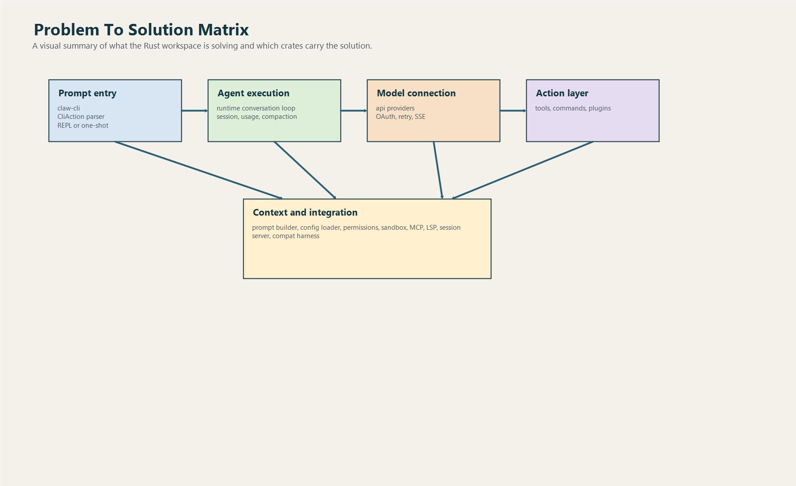

# Các Vấn Đề Rust Code Đang Giải Quyết Và Cách Giải

## 1. Mục tiêu của file này

File này gom toàn bộ góc nhìn “bài toán -> cách giải -> luồng xử lý -> dùng gì” vào một nơi.

Nó phù hợp khi:

- cần hiểu dự án theo business problem và technical strategy
- cần onboarding nhanh cho người mới
- cần giải thích vì sao workspace lại tách crate như hiện tại

## 2. Bức tranh tổng quát

Rust workspace đang giải một bài toán lớn:

Làm sao xây được một AI coding agent chạy qua CLI nhưng vẫn có:

- prompt orchestration
- tool use
- permission control
- persistence
- plugin ecosystem
- provider flexibility
- dev-environment awareness
- service/integration surface

## 3. Bảng tổng hợp nhanh

| Vấn đề | Cách giải trong code | Luồng xử lý chính | Dùng gì |
|---|---|---|---|
| Nhận prompt và rẽ đúng mode | CLI parser + `CliAction` | `main()` -> `run()` -> `parse_args()` | `claw-cli/main.rs` |
| Chạy agent loop có tool use | `ConversationRuntime` | user -> model -> tool -> model | `runtime/conversation.rs` |
| Giữ state để resume | structured `Session` | push message -> save/load JSON | `runtime/session.rs` |
| Kiểm soát quyền tool | `PermissionPolicy` | tool use -> authorize -> allow/deny | `runtime/permissions.rs` |
| Chèn policy/audit bên ngoài | pre/post hooks | tool call -> hook -> execute -> hook | `runtime/hooks.rs`, `plugins/hooks.rs` |
| Dựng system prompt sát ngữ cảnh | `SystemPromptBuilder` + project discovery | load context -> render section -> compose prompt | `runtime/prompt.rs` |
| Đọc config nhiều tầng | `ConfigLoader` deep merge | discover -> merge -> parse typed config | `runtime/config.rs` |
| Gọi nhiều model/provider | canonical provider layer | pick provider -> stream normalized events | `api/*` |
| Cho agent dùng built-in tool | tool registry + dispatch | tool name -> schema -> execute | `tools/src/lib.rs` |
| Mở rộng bằng plugin | plugin manifest + manager + registry | install/enable -> aggregate -> execute | `plugins/src/lib.rs` |
| Tích hợp workflow người dùng | slash command registry | parse slash -> handler | `commands/src/lib.rs` |
| Kéo tool/resource từ bên ngoài | MCP bootstrap + stdio manager | config -> connect -> index -> call | `runtime/mcp*.rs` |
| Thêm code intelligence | LSP manager | open doc -> diagnostics/refs/defs -> prompt enrich | `lsp/*` |
| Expose session cho service/UI | HTTP + SSE server | create/list/get/stream/send-message | `server/src/lib.rs` |
| So với upstream TypeScript | manifest extraction | read TS source -> extract registries | `compat-harness/src/lib.rs` |

## 4. Đi sâu từng vấn đề

### 4.1. Vấn đề: CLI phải hỗ trợ nhiều mode nhưng vẫn đơn giản cho user

#### Code giải bằng cách nào

- parse argument thủ công
- chuẩn hóa thành `CliAction`
- mọi nhánh đi qua một `match` trung tâm

#### Luồng giải quyết

1. nhận args
2. parse flag chung
3. resolve model alias
4. resolve allowed tool subset
5. xác định action cuối cùng
6. rẽ vào one-shot prompt, REPL, login, resume hoặc utility mode

#### Sử dụng gì

- `claw-cli/main.rs`
- `LiveCli`
- `render`, `input`, `init`

### 4.2. Vấn đề: model phải trở thành agent chứ không chỉ text generator

#### Code giải bằng cách nào

`ConversationRuntime` dựng vòng lặp hội thoại nhiều iteration.

#### Luồng giải quyết

1. push user message
2. gọi API
3. dựng assistant message
4. phát hiện tool use
5. check permission
6. chạy hook
7. execute tool
8. append tool result
9. lặp tiếp nếu cần

#### Sử dụng gì

- `ApiClient`
- `ToolExecutor`
- `Session`
- `UsageTracker`

### 4.3. Vấn đề: cần giữ hội thoại đủ giàu để resume và compact

#### Code giải bằng cách nào

- session structured theo role/block
- usage gắn theo message
- compaction semantic-aware

#### Luồng giải quyết

1. mỗi turn append message thật vào session
2. persist session ra JSON
3. khi dài quá thì compact
4. inject continuation summary thay cho phần lịch sử cũ

#### Sử dụng gì

- `runtime/session.rs`
- `runtime/usage.rs`
- `runtime/compact.rs`

### 4.4. Vấn đề: agent phải biết đang ở đâu và đang làm gì trong repo

#### Code giải bằng cách nào

- scan instruction files
- đọc git status
- đọc git diff
- gộp vào prompt

#### Luồng giải quyết

1. discover project context
2. nạp instruction files từ ancestor chain
3. dedupe theo content
4. render project section
5. render config section
6. append vào system prompt

#### Sử dụng gì

- `ProjectContext`
- `SystemPromptBuilder`
- `ConfigLoader`

### 4.5. Vấn đề: tool mạnh nhưng phải có hàng rào an toàn

#### Code giải bằng cách nào

- permission mode
- permission policy
- allowed tool subset
- runtime hook
- plugin hook

#### Luồng giải quyết

1. tool call được model phát sinh
2. runtime check tool có enabled không
3. runtime map tool -> required permission
4. authorize theo mode hiện tại
5. chạy hook trước
6. execute
7. chạy hook sau

#### Sử dụng gì

- `runtime/permissions.rs`
- `tools/GlobalToolRegistry`
- `runtime/hooks.rs`
- `plugins/hooks.rs`

### 4.6. Vấn đề: một runtime phải nói chuyện được với nhiều backend model

#### Code giải bằng cách nào

- canonical request/response types
- provider abstraction
- streaming normalization

#### Luồng giải quyết

1. chọn provider theo model/credential/env
2. translate request sang shape phù hợp
3. stream response
4. normalize thành event nội bộ
5. trả event cho runtime loop

#### Sử dụng gì

- `api/client.rs`
- `api/providers/*`
- `api/types.rs`

### 4.7. Vấn đề: cần năng lực hành động phong phú nhưng vẫn quản được

#### Code giải bằng cách nào

- built-in tool registry
- plugin tool registry
- schema cho từng tool
- canonical tool definition cho provider

#### Luồng giải quyết

1. build global registry
2. lấy definitions gửi lên model
3. model gọi tool theo tên
4. registry dispatch về built-in hoặc plugin tool

#### Sử dụng gì

- `tools/src/lib.rs`
- `plugins/src/lib.rs`

### 4.8. Vấn đề: cần workflow kiểu devtool chứ không chỉ chat

#### Code giải bằng cách nào

- slash command registry
- workflow handler riêng cho từng nhóm việc

#### Luồng giải quyết

1. user nhập slash command
2. parse ra `SlashCommand`
3. chọn handler tương ứng
4. trả lại message hoặc side effect theo workflow

#### Sử dụng gì

- `commands/src/lib.rs`

### 4.9. Vấn đề: cần mở rộng từ hệ sinh thái ngoài

#### Code giải bằng cách nào

- MCP typed config
- stdio MCP manager
- plugin system
- LSP integration
- HTTP/SSE server

#### Luồng giải quyết

1. load config hoặc registry
2. khởi tạo client/manager tương ứng
3. expose tool, context hoặc session ra runtime

#### Sử dụng gì

- `runtime/mcp.rs`
- `runtime/mcp_client.rs`
- `runtime/mcp_stdio.rs`
- `lsp/*`
- `server/src/lib.rs`

### 4.10. Vấn đề: phải giữ parity với hệ thống gốc mà không bị trói bởi nó

#### Code giải bằng cách nào

- đọc source TypeScript upstream
- extract manifest command/tool/bootstrap
- dùng kết quả để so sánh bề mặt

#### Luồng giải quyết

1. resolve upstream repo root
2. đọc `commands.ts`, `tools.ts`, `cli.tsx`
3. extract symbol/import/feature-gated entry
4. build manifest Rust-side

#### Sử dụng gì

- `compat-harness/src/lib.rs`

## 5. Những nguyên lý thiết kế nổi bật

### Registry-first

Rất nhiều thứ trong code được quản lý dưới dạng registry:

- commands
- tools
- plugins

Điều này làm hệ thống dễ:

- kiểm kê
- validate
- render help
- kiểm soát policy

### Typed boundary

Nhiều chỗ raw JSON/raw env được parse thành type rõ.

Đây là lựa chọn tốt trong Rust vì:

- giảm lỗi ngầm
- dễ test hơn
- dễ review hơn

### Layered trust

Trust không dồn hết vào model.

Có nhiều lớp:

- allowed tools
- permission policy
- runtime hooks
- plugin hooks
- sandbox

## 6. Chốt lại theo một câu

Rust code đang giải bài toán:

“Làm sao biến một CLI AI assistant thành một agent coding platform có trạng thái, có quyền hạn, có khả năng hành động, có mở rộng, và có ngữ cảnh dev-environment đủ sâu để dùng thật.”

Và nó giải bằng cách:

- tách crate theo trách nhiệm
- giữ runtime core sạch
- normalize provider/tool/plugin boundary
- dùng session structured
- đặt policy gate trước execution
- mở rộng context qua prompt, MCP, LSP và service layer
